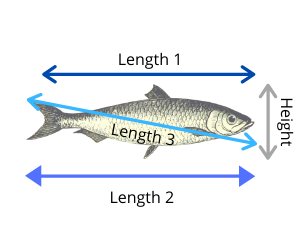

```{r set-up, include = FALSE}
knitr::opts_chunk$set(echo = FALSE,
                      warning = FALSE, 
                      message = FALSE)
```

```{r echo=FALSE}
library(MASS)
```


# 1. Introduction and Dataset

According to alliedmarketresearch.com, the world's fish market size had a value of $\$285,359.7$ million in 2019 and is projected to grow to $\$378,055.5$ million by 2027 (Kadam, 2019). However, due to Covid-19, the demand for fish has gone down due to the closing of public places, restaurants, etc. Similarly, the supply has gone down due to social distancing practices required by the fishermen and the crew. We know that this will allow more fish to grow and reproduce in the ocean and therefore the supply and demand will change after the pandemic.

We figured that this growth time might affect the physical characteristics of fish species. We wanted to test the relationship between the weight of the fish and other characteristics such as length, width, and height. Our dataset is called Fish.csv and it can be found on this link: <https://www.kaggle.com/aungpyaeap/fish-market>. This dataset contains information on 7 different fish species in the world's fish market. We will conduct multiple linear regression analysis on this dataset to test the relationship between predictor variables (Xi): Height, Width, and Lengths and response variable (Y): Weight to see how well our regression line fits the data. We want to be able to predict the weight of a given fish and determine what factors in a fish's physical characteristics play a significant role in its weight.

Defining Response and Predictor Variables:
1.	Y = Weight. Weight of the fish species is measured in grams (g)
2.	X1 = Length1 (in cm)
3.	X2 = Length2 (in cm)
4.	X3 = Length3 (in cm)
5.	X4 = Height (in cm)
6.	X5 = Width (in cm)

Refer to figure 1 to understand the difference between Length1, Length2, and Length3. They are called standard length, total length, and diagonal length. 

**Figure 1:** Difference between Length1, Length2, and Length3. 


First, we will conduct exploratory data analysis to fit the best model using the Stepwise Regression Method in R. Using the stepAIC function in R, we can check for statistical significance of our relationships, as it will look at the p-values of our coefficients and remove the coefficients that have p-values above 0.05. Before we can conduct a hypothesis test on this data, we would make several diagnostics plots such as residuals vs fitted, scatter plot etc. to understand the distribution of our dataset and check the linear regression assumptions. After verifying the assumptions we will take remedial measures on the failed ones and then conclude the characteristics of our final model. We will conduct 2 hypothesis tests in this paper, **F-test** and **Breusch & Pagan Test**.  

# 2. Exploratory Data Analysis (EDA)

First we will import the data sheet in R and use the str() function to get the first glimpse of our dataset and the dependent and independent variables it contains. Here is the output.

```{r echo=F}
library(ggplot2)
library(dplyr)
```

```{r echo=FALSE}
rm(list=ls())
Fish <- read.csv("data/Fish.csv", header=TRUE)
```


```{r echo=F}
str(Fish)
```

This output shows us that apart from ‘Species,’ all other variables are continuous and hence we are good to use our dependent and independent variables for multiple regression. 

Now we will use the summary() function in R to see the structure of our dataset to check for outliers and/or any missing values. We will use R to test whether there are any missing data points.

```{r echo=F}
summary(Fish)
```

Although, there are no missing data points or negative values, there is one outlier. The data point in row 42, Species: Roach, has a weight of **0 grams**. This indicates that it is an outlier and to avoid errors when using transformations in future, we will drop this data point to avoid errors.
As we can see that using the str() and summary() function gave us some information regarding 2 of our multiple linear regression assumptions, no outliers and data should be continuous. To check for more assumptions and further analyze our data, we will use several visual and data analysis techniques. 

Now we will make a density plot, to study how our response variable (Weight) is distributed, categorized by each species. Here is the outcome.

```{r echo=F}
Fish <- Fish%>%
  filter(Weight>0)
```

**Figure 2:** Density plot of each species of fish. 
```{r echo=F}
Fish.means <- Fish %>%
              group_by(Species)%>%
              summarise(Mean_weight=mean(log(Weight)))


ggplot(Fish,aes(x=log(Weight),fill=Species,color=Species,group=Species))+
  geom_density(alpha=0.4,lwd=1)+
  geom_vline(data=Fish.means,aes(xintercept = Mean_weight,color=Species),lwd=2,lty="dashed")+
  scale_x_continuous(limits = c(1.5,8.5))+ ggtitle("Distribution of Weight by Species")
```

We can see that the mean weight for each species is different (represented by colored vertical lines). Since ‘Species’ is a factor variable, we will need to create 7 dummy variables and fit 7 different fitted models with their own unique intercepts, we will not consider Species as a predictor variable in our regression model to avoid complexity.

Another assumption that we need to check before we can start to fit the straight line model is the linearity of relationship between variables. To check whether there is a linear relationship between our response variable (Weight) and predictor variables (Xi’s), we will plot individual scatter plots of Weight vs Xi’s for i = 1 to 5. 

**Figure 3:** Scatter plots 
```{r echo=F}
par(mfrow=c(2,3))
plot(x=Fish$Length1, y=Fish$Weight, xlab="Length 1 in cm", ylab="Weight in g", main="Scatter plot of Weight vs Length1")
plot(x=Fish$Length2, y=Fish$Weight, xlab="Length 2 in cm", ylab="Weight in g", main="Scatter plot of Weight vs Length2")
plot(x=Fish$Length3, y=Fish$Weight, xlab="Length 3 in cm", ylab="Weight in g", main="Scatter plot of Weight vs Length3")
plot(x=Fish$Height, y=Fish$Weight, xlab="Height in cm", ylab="Weight in g", main="Scatter plot of Weight vs Height")
plot(x=Fish$Width, y=Fish$Weight, xlab="Width in cm", ylab="Weight in g", main="Scatter plot of Weight vs Width")

```

The scatter plots above show that the relationship of **Weight** vs our predictor variables: **Length1, Length2, Length3, Height and Width**, is not linear. This violates our assumption of linearity for multiple linear regression and fitting a straight line model might not be the best estimator of our response variable. We can fix this in two ways. We can either come up with a more complex model that explains the data better, or, we can transform our data accordingly that modifies the relationship between our response and predictor variables into a linear relationship.

Looking at the scatter plots above, it is clear that the relationship between response and predictor variables seems somewhat exponential. To transform this into a linear relationship, we can apply logarithmic transformation on the model.  We will now look at the scatter plot of log(Weight) against log(predictor variables). Figure 4 below shows the scatter plots of the transformed Log-Log model.

**Figure 4:** Scatter plots of Transformed Model 
```{r}
par(mfrow=c(2,3))
plot(x=log(Fish$Length1), y=log(Fish$Weight), xlab="log Length 1 in cm", ylab="log Weight in g", main="Scatter plot of Weight vs Length1")
plot(x=log(Fish$Length2), y=log(Fish$Weight), xlab="log Length 2 in cm", ylab="log Weight in g", main="Scatter plot of Weight vs Length2")
plot(x=log(Fish$Length3), y=log(Fish$Weight), xlab="log Length 3 in cm", ylab="log Weight in g", main="Scatter plot of Weight vs Length3")
plot(x=log(Fish$Height), y=log(Fish$Weight), xlab="log Height in cm", ylab="log Weight in g", main="Scatter plot of Weight vs Height")
plot(x=log(Fish$Width), y=log(Fish$Weight), xlab="log Width in cm", ylab="log Weight in g", main="Scatter plot of Weight vs Width")

```

The above scatter plots were obtained after the transformations to make our relationship between response and predictor variables linear. We can see that a straight line can fit our data and the relationship is more linear with even less difference between the weights of various species in our dataset. 

Since we see that the relationship between Weight and  Length1, Length2, Length3 is somewhat similar. Upon finding the summary of the full model, the three lengths have higher p-values. This indicates that they might be correlated. In order to find the correlation between Length1, Length2, and Length3, we will use the cor() function in R. This will give us the variance-covariance matrix for our independent variables. Here is the output. 

```{r echo=F}
Fish %>% 
  select(Weight, Length1, Length2, Length3, Height, Width) %>% 
  cor()
```

In the variance-covariance matrix above, we can see that the correlation values between Length1, Length2, and Length3 are 0.9995. 0.9920, and 0.9941. This indicates that our variables are multicollinear and hence they might not be independent. From the figure 1 above and the correlation values between the Lengths, we conclude that this information is redundant and we will not consider Length3 from our full model. Moreover, our data values of lengths are very close therefore it's also an indication of redundant information. The full model will consist of the following predictor variables: Length1, Length2, Height, and Width. 

**Our Full Model Equation:** $Y_i=\beta_0+\beta_1X1+\beta_2X2+\beta_4X4+\beta_5X5+\epsilon_i$

Now we will conduct the stepwise regression in R to remove any variables who’s p-values are greater than 0.05. The output is shown in figure 5 below. 

**Figure 5:** Model Summary after StepAIC in R.
```{r echo=F}
full.model <- lm(Weight~Length1 + Length2 + Height + Width, data = Fish)

step.model <- stepAIC(full.model, direction = "backward", trace = FALSE)

summary(step.model)
```

The above output shows that R removed the variable Length2 (Xi) from our Full Model. The p-value of Length2 is 0.83, therefore, it is not significant to our model. Consequently, we get a reduced model for our regression line. 

Our Reduced Model Equation: $Y_i=b_0+b_1X_1+b_4X_4+b_5X_5$ 
Where:
b0= -511.471  b1= 22.605 b4=13.590 b5= 44.266 X1 = Length1 X4=Height X5=Width 

To understand which model works better for our data, we will conduct the F-test to test if any of the independent variables in multiple linear regression are significant or not. This is a way to confirm our results from the stepwise regression. 

Hypothesis for F-test:

H0:$\beta_2=\beta_3=0$ 
Ha:$\beta_2≠\beta_3≠0$ 

**Figure 6:** Anova table for F-test.
```{r echo=F}
anova(step.model, full.model)
```

The Anova table above shows that the p-value is 0.1722. Therefore, we fail to reject the null hypothesis. This tells us that 2 and 3are not significant to our dataset and therefore we should fit the reduced model. 

# 3. Diagnostic Study and Remedial Measures.
Before we choose the final fitted  model, we will conduct diagnostic study on our selected reduced model. Below is the output of the histogram of residuals.

**Figure 7:** Histogram of Residuals.
```{r echo=F}
Resid <- step.model$residuals

hist(Resid, xlab="Residuals", ylab="Frequency", main="Histogram of Residuals")
```

The histogram of residuals plot is slightly right skewed, which suggests that the normality of error terms assumption might be violated. To further investigate the behavior of residuals, we will plot several residual plots. Figure 8 shows the R output. 

**Figure 8:** The residual vs fitted plot.
```{r echo=F}
par(mfrow=c(2,2))
plot(x=Fish$Length1, y=Resid, xlab="Length 1 in cm", ylab="Residuals", main="Scatter Plot of Residuals and Length 1")
plot(x=Fish$Width, y=Resid, xlab="Width in cm", ylab="Residuals", main="Scatter Plot of Residuals and Width")
plot(x=Fish$Height, y=Resid, xlab="Height in cm", ylab="Residuals", main="Scatter Plot of Residuals and Height")
plot(x=step.model$fitted.values, y=Resid, xlab="Fitted values", ylab="Residuals", main="Scatter Plot of Residuals and Fitted Values")
```

Figure 8 above shows that all four residual plots have patterns, which means that the constant variance assumption for our linear regression is violated. We will fix it later in the paper before fitting our final model. Now we will check if our error terms in the model are independent. Figure 9 below is the scatter plot of residuals vs index.

**Figure 9:** Scatter plot of residuals vs index.
```{r echo=F}
plot(Resid, xlab="Index", ylab="Residuals", main="Scatter plot of Residuals")
```

The above scatter plot clearly has multiple downward sloping patterns. This violates the assumption of error terms being independent. Moreover, the normal Q-Q Plot below confirms our claim that error terms are not normally distributed. This can be seen in the concave patterns in the normal Q-Qplot below in Figure 10.

**Figure 10:** Normal Q-Q Plot.
```{r echo=F}
qqnorm(Resid)
qqline(Resid)
```

As we saw above that several assumptions for multiple linear regression were violated, we will transform the data as a remedial measure to the failed assumptions. Since the scatter plot of data above showed somewhat closer to exponential pattern, we applied logarithmic transformations and obtained the following Log-Log linear regression model below. 

**Our Transformed Model:** $log(Y_i)=\beta_0+\beta_1log(X_1)+\beta_4log(X_4)+\beta_5log(X_5)+\epsilon_i$

**Figure 11:** Scatter plots of data before and after transformation.
```{r echo=F}
par(mfcol=c(2,3))

plot(x=Fish$Length1, y=Fish$Weight, xlab="Length 1 in cm", ylab="Weight in g", main="Scatter plot of Weight vs Length1")
abline(lm(Fish$Weight~Fish$Length1), col="red")
plot(x=log(Fish$Length1), y=log(Fish$Weight), xlab="log Length 1 in cm", ylab="log Weight in g", main="Scatter plot of Transformed Weight vs Length1")
abline(lm(log(Fish$Weight)~log(Fish$Length1)), col="red")

plot(x=Fish$Height, y=Fish$Weight, xlab="Height in cm", ylab="Weight in g", main="Scatter plot of Weight vs Height")
abline(lm(Fish$Weight~Fish$Height), col="red")
plot(x=log(Fish$Height), y=log(Fish$Weight), xlab="log Height in cm", ylab="log Weight in g", main="Scatter plot of Transformed Weight vs Height")
abline(lm(log(Fish$Weight)~log(Fish$Height)), col="red")
plot(x=Fish$Width, y=Fish$Weight, xlab="Width in cm", ylab="Weight in g", main="Scatter plot of Weight vs Width")
abline(lm(Fish$Weight~Fish$Width), col="red")
plot(x=log(Fish$Width), y=log(Fish$Weight), xlab="log Width in cm", ylab="log Weight in g", main="Scatter plot of Transformed Weight vs Width")
abline(lm(log(Fish$Weight)~log(Fish$Width)), col="red")

```

In figure 11, we can see that after the logarithmic transformation to our reduced model, the relationship is linearized. This was shown above for our initial full model. This is a remedial measure to the violated assumption of linearity mentioned above.

**Figure 12:** Summary of Transformed Model.
```{r echo=F}
trans.fit <- lm(log(Weight)~log(Length1)+log(Height) + log(Width), data=Fish)
summary(trans.fit)
```

The summary table above shows us the p-values of the transformed covariates log(Length1), log(Height), and log(Width) of our model. Since these p-values are close to zero, we can say that these variables are statistically significant to predict our response variable. Moreover, the R-squared is high which suggests a strong linear relationship. Since we transformed our model, the dependent variable is not the same as our original dependent variable (Y  log(Y)). 
To test the constant variance assumption, we will plot the residual plots of our transformed model. Figure 13 below shows the residual plots. 

**Figure 13:** Residual Plots for Transformed Model.
```{r echo=F}
trans.Resid <- trans.fit$residuals

par(mfrow=c(2,2))
plot(x=log(Fish$Length1), y=trans.Resid, xlab="log Length 1 in cm", ylab="Residuals", main="Scatter Plot of Residuals and Length 1")
abline(a=0, b=0)
plot(x=log(Fish$Width), y=trans.Resid, xlab="log Width in cm", ylab="Residuals", main="Scatter Plot of Residuals and Width")
abline(a=0, b=0)
plot(x=log(Fish$Height), y=trans.Resid, xlab="log Height in cm", ylab="Residuals", main="Scatter Plot of Residuals and Height")
abline(a=0, b=0)
plot(x=trans.fit$fitted.values, y=trans.Resid, xlab="Fitted values", ylab="Residuals", main="Scatter Plot of Residuals and Fitted Values")
abline(a=0, b=0)
```

From the above residual plots in figure 13, we can see that residual vs fitted plot does not follow a pattern anymore. This satisfies our assumption of constant variance. Furthermore, to check the same assumption, we will use the Breusch & Pagan Test. 


Our Hypothesis for Breusch & Pagan Test:

$H_0:\sigma^2{{\epsilon_1}} =\sigma^2{{\epsilon_2}} =\sigma^2{{\epsilon_i}}$
$H_a:\sigma^2{{\epsilon_1}} ≠\sigma^2{{\epsilon_2}} ≠\sigma^2{{\epsilon_i}}$

Below is the R output of our test. It shows us that the p-value is 0.9272. Since our p-value is greater than 0.05, we fail to reject the null hypothesis. This satisfies our assumption of constant variance.

```{r echo=F}
library(lmtest)
bptest(trans.fit)
```

Now we will look at the plot of residual vs index for our transformed model. Figure 14  below shows the scatter plot of residuals vs index as well as the normal Q-Q Plot.

**Figure 14:** Residual plot vs index and Normal Q-Q Plot
```{r echo=F}
par(mfrow=c(2,2))
plot(trans.Resid, xlab="Index", ylab="Residuals", main="Scatter plot of Residuals")
qqnorm(trans.Resid)
qqline(trans.Resid)
```

As we can see above that the scatter plot of residuals vs index does not have any patterns and this indicates that our error terms are independent. Moreover, the Q-Q Plot suggests that they are normally distributed. Finally, we have verified all the assumptions of multiple linear regression for our transformed model. 

# 4. Interpretation and Conclusion.

Based on our investigation above, we finally conclude to choose the transformed model: log(Yi)=0+1log(X1)+4log(X4)+5log(X5 )+i to predict the Weight of fish. The transformed model gives R2=0.969, which means that our model is a good fit for the data.


1= 1.43 (given all other variables are constant, 1 cm change in the length of the fish will change the weight of the fish in the same direction by e1.43 grams on average) 


4= 0.63 (given all other variables are constant, 1 cm change in the height of the fish will change the weight of the fish in the same direction by e0.63 grams on average)


5= 0.95 (given all other variables are constant, 1 cm change in the width of the fish will change the weight of the fish in the same direction by e0.95 grams on average)

As we can see, we began our regression analysis with some exploratory data analysis and realized that our data does not fit a linear model really well. Therefore, we decided to transform the model as a remedial measure and verified all assumptions of multiple linear regression model using  several statistical approaches. Finally, we were able to select a modified model that is a better predictor of weight than our initial linear regression model.

We believe that with increasing aqua farming culture, the fish farms can use camera sensor technologies to measure the physical characteristics of fish such as Length, Width and Height. Instead of measuring each fish individually, similar models can be used to predict the weight of the fish based on certain measurements taken by the camera. This will help businesses improve their diversification and categorization processes. We found this project really interesting and learned a lot throughout. For further analysis, we can consider collecting data on more species of fish and maybe even try to see the relationship between each species separately.

